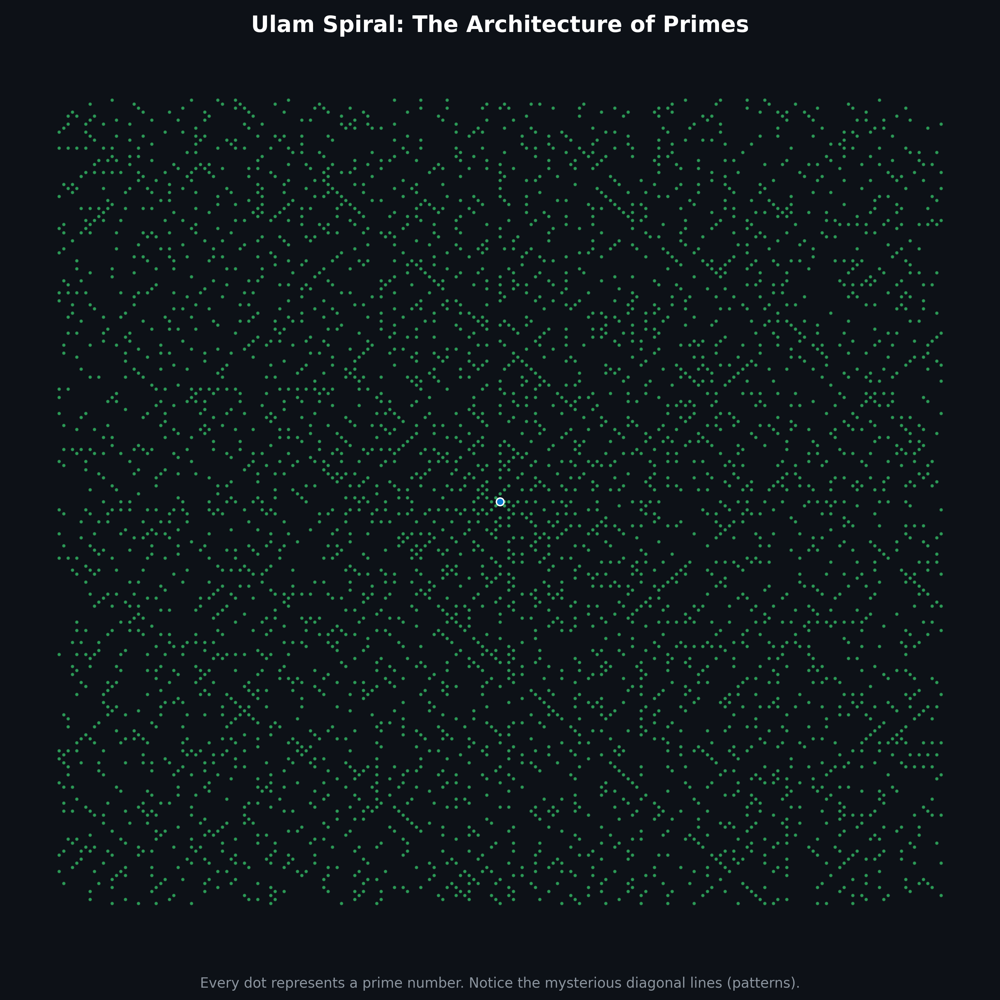
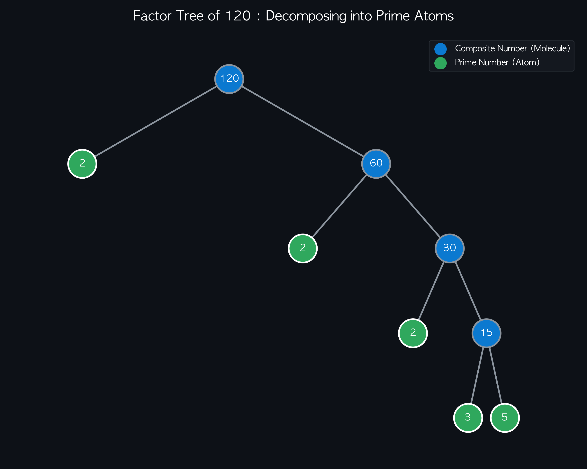

# 01. 소인수분해 (Prime Factorization)

> **수학적 원자(Atom)를 찾아가는 여정: 우주의 기본 단위를 마주하다**

---

## 1. 묵상과 사유 (철학적·종교적 관점)

청소년 시절의 소인수분해는 그저 '나눗셈을 거꾸로 해서 공통된 인수를 찾는 지루한 연산'이었을지 모릅니다. 하지만 긴 호흡으로 바라보는 소인수분해는 세상의 근원을 탐구하는 철학적 질문과 맞닿아 있습니다.

- **수학의 원자(Atom), 소수 (Prime Number)**
  고대 그리스 철학자 데모크리토스는 물질을 쪼개고 쪼개면 더 이상 쪼갤 수 없는 궁극의 단위인 '원자(Atom)'에 도달한다고 믿었습니다.
  수학의 세계에서 **소수(Prime Number)**는 바로 이 '원자'와 같습니다. 1보다 큰 자연수 중 1과 자기 자신만을 약수로 가지는 소수는, 수의 세계에서 더 이상 쪼갤 수 없는 물질의 최소 단위입니다.
- **산술의 기본 정리 (The Fundamental Theorem of Arithmetic)**
  "1보다 큰 모든 자연수는 단 하나의 유일한 소수들의 곱으로 나타낼 수 있다." (순서 제외)
  이 정리는 우주의 만물이 원소들의 결합으로 탄생하듯, 수의 우주에 존재하는 무한한 수들이 사실은 소수라는 기본 원소들의 독특한 결합방식으로 창조되었음을 보여줍니다.
  예를 들어 `60`이라는 수는 단순히 크기 60의 숫자가 아니라, `2`라는 원자 2개, `3`이라는 원자 1개, `5`이라는 원자 1개가 결합하여 만들어진 화학 분자 $[2^2 \times 3 \times 5]$와 같습니다.

- **종교적·사유적 관점: 순수성과 개별성**
  소수는 다른 수들에 의해 나누어지거나 규정되지 않고 오직 '1(하나님, 혹은 우주의 근원적 일자)'과 '자기 자신'을 통해서만 규정됩니다. 타협하지 않는 독자적이고 순수한 존재들인 소수가 모여, 질서 정연한 거대한 합성수의 세계를 구성한다는 사실은 개개의 영혼의 고귀함과 전체 우주의 조화를 연상시킵니다.

---

## 2. 왜 사용하는가? 실제 생활에서의 적용점

- **현대 문명을 지키는 방패: RSA 암호 알고리즘**
  오늘날 우리가 사용하는 인터넷 뱅킹, 공인인증서, HTTPS 보안 통신의 이면에는 소인수분해가 있습니다.
  두 개의 아주 큰 소수(예: 수백 자리의 소수 $p$와 $q$)를 곱해 하나의 거대한 수 $N = p \times q$를 만드는 것은 컴퓨터로 순식간에 할 수 있습니다. 하지만 반대로 거대한 수 $N$을 보고 원래의 $p$와 $q$를 찾아내는 소인수분해 작업은 슈퍼컴퓨터로도 수백 년이 걸립니다. 이 **비대칭적 난이도**를 이용하여 전 세계의 정보 보안 시스템이 구축되었습니다.
- **생존을 위한 진화: 주기매미(Periodical Cicada)의 지혜**
  북미에 서식하는 어떤 매미들은 13년 또는 17년이라는 정확한 주기를 두고 땅속에서 나와 번식합니다. 왜 하필 13과 17일까요? 두 수는 모두 **소수**입니다.
  포식자(새, 다람쥐 등)의 번식 주기가 보통 2년, 3년, 4년 등인데, 만약 매미의 주기가 12년(합성수)이라면 2, 3, 4, 6년 주기의 포식자들과 자주 겹치게 됩니다. 하지만 소수인 13년이나 17년을 주기로 선택함으로써 포식자와의 조우 주기를 최소화하여 종의 생존율을 극적으로 높였습니다. 자연조차도 소수의 성질을 이용해 진화한 것입니다.

---

## 3. 질문을 통한 한 걸음 더 (Joshua를 위한 열린 질문)

이 단원을 지나가며 함께 고민해보고 싶은 질문들입니다. 가상환경이 구축된 후 파이썬 코드를 통해 직접 시각화하며 답을 찾아갈 예정입니다.

1. **질문 1**: 무한히 많은 자연수 중에서 소수는 얼마나 자주 등장할까요? 수가 커질수록 소수의 밀도는 어떻게 변할까요?
2. **질문 2**: 소수의 분포에는 어떤 규칙성이 있을까요? 아니면 완전히 무작위(Random)일까요?
3. **질문 3**: 자연수를 소인수분해하여 나타내는 분자 구조(트리 구조)를 시각적으로 어떻게 표현할 수 있을까요?

---

## 4. 파이썬 시각화 예고

우리는 첫 번째 실습으로 다음 코드를 작성하고 실행할 것입니다.

- **`ulam_spiral.py`**: 소수들을 나선형 격자에 점으로 찍어 소수의 패턴을 시각화하는 울람의 나선(Ulam Spiral) 그리기.
  
- **`factor_tree.py`**: 특정 합성수를 입력하면 소인수의 결합 트리를 시각화해주는 스크립트.
  
