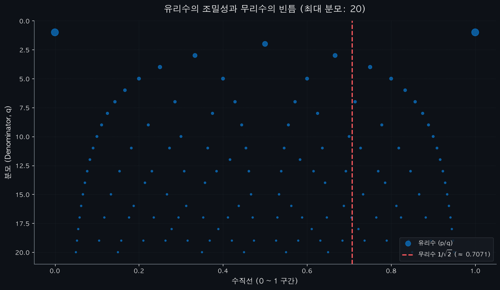
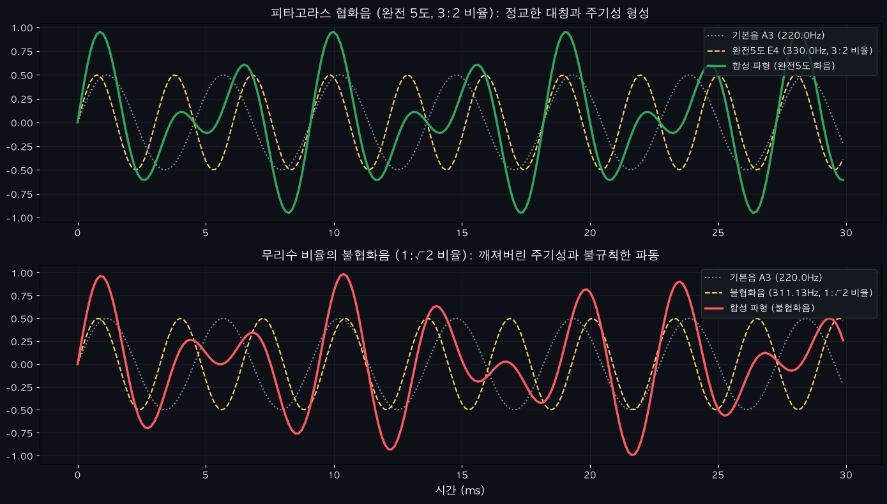

# 02. 정수와 유리수 (Integers & Rational Numbers)

> **기준(0)을 세우고 양방향의 균형을 잡다: 존재와 결핍, 그리고 조화의 이성**

---

## 1. 묵상과 사유 (철학적·종교적 관점)

자연수(Natural Number)가 '눈에 보이는 풍요'와 '존재함의 개수'를 세는 것에서 출발했다면, 정수와 유리수의 도입은 인간의 인식이 더 깊은 차원의 대칭과 관계, 그리고 논리적 비율의 세계로 도약했음을 의미합니다.

- **기준점 '0(Zero)'과 공(空)의 포용**
  수학 역사상 '0'의 탄생은 혁명이었습니다. 0은 단순한 '없음'이 아닙니다. 0은 존재와 비존재의 경계선이며, 모든 변화와 확장이 시작되는 절대적인 '기준(Origin)'입니다.
  종교적으로 0은 창조 이전의 공허(Chaos)와 무(無, Nothingness)를 상징하는 동시에, 무한한 잠재력을 품은 침묵의 자리입니다. 기준이 없으면 방향도 없고, 0이 없으면 양수와 음수의 구분도 성립할 수 없습니다.

- **음수(Negative Number): 결핍이 창조한 새로운 차원**
  음수는 오랫동안 '거짓의 수', '불가능한 수'로 부정당했습니다. 현실 세계에서는 사과 '-3개'를 직접 손에 쥘 수 없기 때문입니다. 하지만 수학은 음수를 통해 단순한 '수량의 존재'를 넘어 **'방향성(Direction)'과 '대칭성(Symmetry)'**이라는 새로운 지평을 열어주었습니다.
  나에게서 빠져나간 부채(-)가 상대방에게는 자산(+)이 되듯, 우주는 양(Positive)과 음(Negative)의 완벽한 대칭과 균형 속에서만 안정적으로 존재할 수 있습니다. 결핍과 빚이 오히려 존재를 온전하게 규정하는 거울이 되는 셈입니다.

- **유리수(Rational Number): 이성의 비율(Ratio)과 나눔의 미학**
  유리수의 영문명인 'Rational Number'는 'Ratio(비율)'에서 기원하지만, 철학적으로는 '이성적인(Rational)'이라는 의미와도 닿아 있습니다. 고대 그리스 피타고라스 학파는 우주의 모든 만물과 그 질서가 정수들의 정교한 비율(유리수)로 조밀하고 완벽하게 설명될 수 있다고 믿었습니다.
  즉, 유리수는 혼돈스러운 세상을 명확한 비례와 조화로 설명해 내려는 이성의 아름다운 도구입니다. 한 덩이의 떡을 공평하게 나누는 나눔(분수)의 질서 역시 유리수의 근본 정신에 닿아 있습니다.

---

## 2. 왜 사용하는가? 실제 생활에서의 적용점

- **세상의 모든 균형을 잡는 뼈대: 회계와 복식부기(Double-entry Bookkeeping)**
  현대 자본주의와 비즈니스를 움직이는 회계 시스템은 정수의 대칭성(+와 -)에 기반합니다. 자산과 자본, 부채를 대변과 차변으로 나누어 기록하고, 최종적으로 이들의 합이 '0'이 되도록 하여 재무 흐름의 오류를 완벽하게 잡아냅니다. 음수의 개념이 없었다면 현대의 정교한 경제 예측과 신용 제도는 존재할 수 없었을 것입니다.

- **가장 아름다운 소리의 비밀: 화음(Harmonics)과 피타고라스 음률**
  우리가 듣는 아름다운 음악적 화음은 유리수의 비례 관계 위에 지어져 있습니다.
  피타고라스는 현악기의 줄 길이를 원래 길이의 $\frac{1}{2}$(2:1 비율)로 줄이면 딱 한 옥타브 높은 도가 소리 나고, $\frac{2}{3}$(3:2 비율)로 줄이면 완전5도(도와 솔)의 아름다운 협화음이 발생한다는 사실을 발견했습니다. 소리의 진동수가 만드는 정교한 유리수 비율이 인간의 뇌와 마음을 평안하게 만드는 '화음'의 실체입니다.

- **공간의 압축과 이성적 이해: 축척(Scale)**
  지도의 `1:25,000`이나 `1:50,000` 같은 비율은 거대한 지구의 땅 표면을 인간이 한눈에 파악할 수 있도록 유리수의 원리로 압축해 놓은 것입니다. 정교한 이성의 비율을 활용해 시공간을 안전하게 내면화하고 다루는 셈입니다.

---

## 3. 질문을 통한 한 걸음 더 (Joshua를 위한 열린 질문)

1. **질문 1**: 수직선 위에 유리수를 촘촘하게 찍는다면, 수직선의 모든 빈틈을 유리수만으로 완전히 메울 수 있을까요? 유리수는 얼마나 조밀하게 모여 있을까요?
2. **질문 2**: 피타고라스 학파는 모든 수가 유리수라고 굳게 믿었으나, 한 변의 길이가 1인 직각이등변삼각형의 대각선 길이($\sqrt{2}$)가 유리수 비율로 표현되지 않는다는 사실에 깊은 실의와 충격을 받았습니다. 유리수로 다 설명할 수 없는 수직선의 빈틈(무리수)은 우리에게 어떤 사유를 건넬까요?
3. **질문 3**: 일상이나 비즈니스에서 '0' 혹은 '기준'을 잘못 설정하여, 방향성(+와 -)을 잃어버렸던 경험이 있으신가요?

---

## 4. 파이썬 시각화 예고

우리는 두 번째 수학 Retreat 실습으로 다음 코드를 작성하여 유리수의 구조적 아름다움을 감상할 것입니다.

- **`rational_density.py`**: 수직선 위에 분모가 커짐에 따라 유리수들이 얼마나 조밀(Dense)하게 채워지는지 시각화하고, 그 사이사이에 숨은 무리수들의 빈틈을 직관적으로 탐색해보는 그래픽 도구.

- **`pythagorean_harmonics.py`**: 현의 길이와 주파수를 유리수 비율로 조정하며, 실제로 아름다운 화음의 파형(Waveform)이 어떻게 물리적으로 중첩되고 조화를 이루는지 듣고 눈으로 관찰하는 대화형 사운드 시각화 스크립트.

