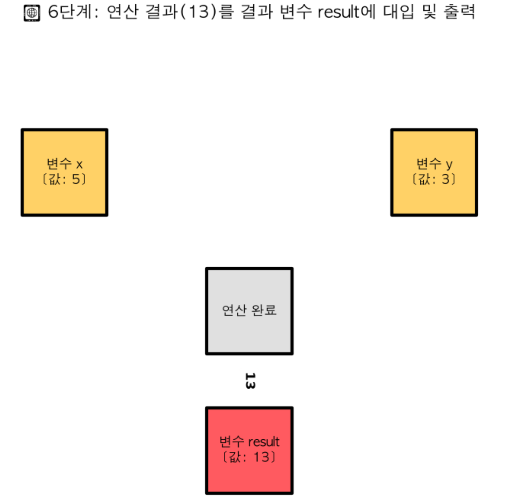
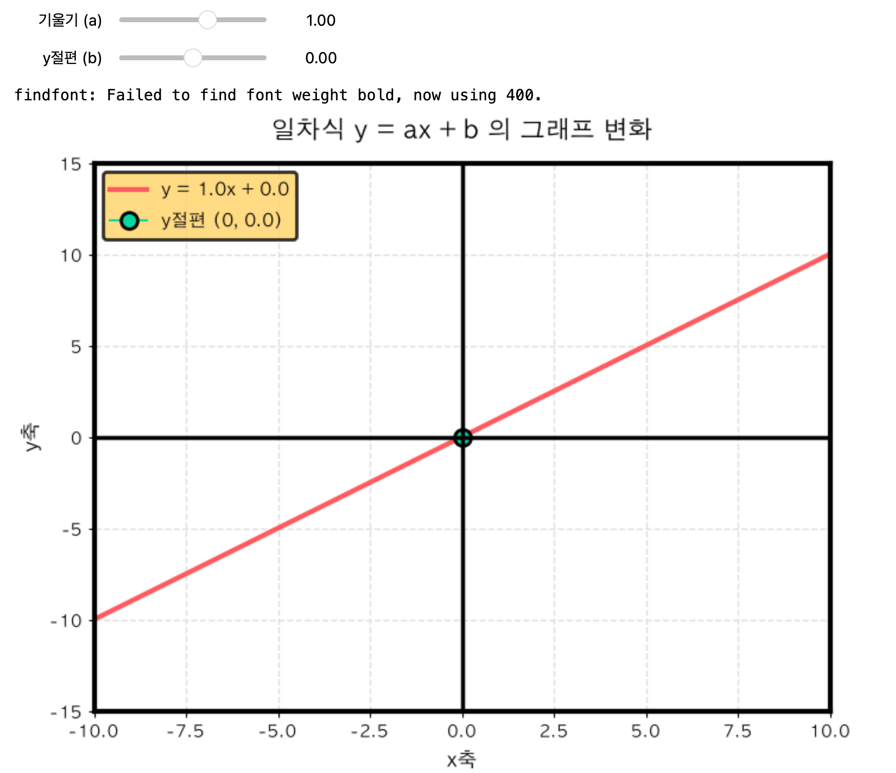

# 03. 문자와 식 (Algebraic Expressions)

> **구체성에서 본질로의 도약: 보이지 않는 관계를 기호로 명명하다**

---

## 1. 묵상과 사유 (철학적·종교적 관점)
수학에서 구체적인 숫자를 넘어서 문자(Alphabet)를 사용하기 시작하는 단계는, 인간의 사유가 눈앞의 감각적 세계에서 보이지 않는 추상적 본질의 세계로 나아가는 위대한 징검다리입니다.

- **추상화(Abstraction): 개별성 너머의 보편적 질서**
  사과 3개, 책 5권, 돈 10원은 눈에 보이고 손에 잡히는 구체적 대상들입니다. 그러나 이것들을 문자 $x, y, a$로 바꾸는 순간, 우리는 개별적 사물의 성질을 털어내고 오직 그것들 사이에 흐르는 **'수학적 관계의 본질'**만을 직시하게 됩니다. 
  종교적으로 이는 변화무쌍하고 유한한 현상계(Phenomena) 너머에 존재하는 불변하고 영원한 창조의 법칙(Logos, 혹은 이데아)을 탐구하는 철학적 태도와 닿아 있습니다.

- **미지수 $x$의 신비: 가능성이 머무는 빈 방**
  문자 $x$는 아직 드러나지 않은 수, 즉 미지수(Unknown)입니다. 그러나 이 공간은 영원히 닫혀 있는 어둠이 아니라, 조건에 따라 무엇이든 담길 수 있는 **'가능성의 여백'**입니다. 
  종교적 관점에서 우리의 미래나 신의 섭리는 인간의 지혜로는 당장 알 수 없는 '미지수 $x$'와 같습니다. 하지만 이 $x$는 약속된 적절한 때와 조건(방정식)이 갖추어질 때 선명하게 실체를 드러내도록 설계된, 은혜로운 잠재적 공간입니다.

- **기호(Symbol)의 권세: 이름을 불러 질서를 잡다**
  성경에서 첫 인류인 아담이 동물들의 이름을 부름으로써 세상의 질서가 시작되었듯, 복잡한 일상의 수학적 조건들을 $2x + 5$와 같이 단순한 식으로 명명하는 순간, 혼돈스럽던 수치 관계는 우리의 통제와 분석 범위 안으로 들어옵니다. 문자로 명명하는 행동은 우주를 이해하고 다스리려는 인간 이성의 존엄한 대리적 통치 방식입니다.

---

## 2. 왜 사용하는가? 실제 생활에서의 적용점

- **현대 디지털 우주를 코딩하는 힘: 변수(Variable)**
  오늘날 우리가 사용하는 모든 웹사이트, 인공지능(AI), 금융 알고리즘은 파이썬이나 자바스크립트 같은 프로그래밍 언어로 지어져 있습니다. 그리고 프로그래밍 언어의 본질은 다름 아닌 '변수(Variable)'입니다. 구체적인 문자열이나 숫자가 들어오기 전에 `user_name`이나 `account_balance` 같은 기호를 먼저 정의하고 식을 빌드해두는 기술은 모두 중학교 1학년 때 배우는 대수식의 원리를 그대로 가져다 쓴 것입니다.

- **자연 법칙을 표현하는 시(Poem): 물리 법칙 공식**
  아인슈타인의 $E=mc^2$이나 뉴턴의 $F=ma$ 같은 공식들은 우주의 어마어마한 질서와 상호작용을 단 몇 개의 문자로 완벽하게 압축해 낸 문학적 시(Poem)와 같습니다. 만약 이를 문자로 쓰지 않고 말로 서술했다면 수백 페이지의 책이 필요했을 것이며, 계산과 적용은 불가능했을 것입니다. 문자는 방대한 우주의 법칙을 인간의 뇌 속으로 가볍게 순간이동시키는 놀라운 언어입니다.

- **복잡한 비즈니스 의사결정의 뼈대: 엑셀(Excel)과 금융 계산**
  이자가 붙는 복리 계산 공식이나, 회사 직원들의 연봉과 세금을 구하는 다단계 조건식은 모두 기호와 문자로 사전에 식을 짜둔 뒤 숫자를 대입하는 구조입니다. 비즈니스 설계자들은 이미 매일 복잡한 '문자와 식'의 우주에서 연산하고 있습니다.

---

## 3. 질문을 통한 한 걸음 더 (Joshua를 위한 열린 질문)

1. **질문 1**: 숫자로만 이루어진 산수(Arithmetic)에서 문자를 사용하는 대수(Algebra)로 넘어갈 때, 우리의 생각은 '구체적 연산'에서 '추상적 구조화'로 넘어가게 됩니다. 이 인지적 패러다임의 도약이 비즈니스나 삶의 문제를 추상화하여 단순하게 만들 때 어떻게 응용될 수 있을까요?
2. **질문 2**: 식 $2x + 5$는 $x$에 어떤 수든 대입할 수 있는 보편적 규칙입니다. 그러나 분모에 문자가 오게 되는 식 $\frac{1}{x}$에서는 $x=0$을 대입할 수 없는 것처럼 보편적 규칙 안에서 작동이 불가능해지는 '임계적 금기의 영역'이 존재합니다. 우리의 시스템 설계나 인생의 룰에서도 이런 '예외적 임계점'은 어떤 의미가 있을까요?
3. **질문 3**: 지금 비즈니스나 인생의 방정식 속에서 가장 선명하게 풀고 싶으신 '미지수 $x$'와 이를 둘러싼 핵심 '조건식'은 어떻게 표현될 수 있을까요?

---

## 4. 파이썬 시각화 예고

우리는 세 번째 수학 Retreat 실습으로 다음 코드를 실행하고 조작해 볼 예정입니다.
- **`algebraic_slider.py`**: 일차식 $y = ax + b$의 기울기($a$)와 상수($b$) 값을 화면의 슬라이더를 조절하여 변화시키면서, 수식(식)의 정량적 변화가 기하학적(공간적) 직선의 변화로 어떻게 즉각 번역되는지 보여주는 인터랙티브 그래프 대시보드.

- **`variable_memory_flow.py`**: 컴퓨터 메모리 상에서 문자로 지정된 공간(변수)에 데이터가 어떻게 흘러 들어가고 연산 결과가 다시 반환되는지를 그래픽 노드 애니메이션으로 시각화한 시뮬레이터.
