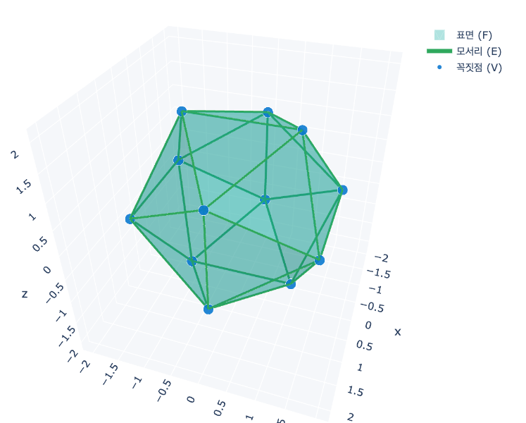
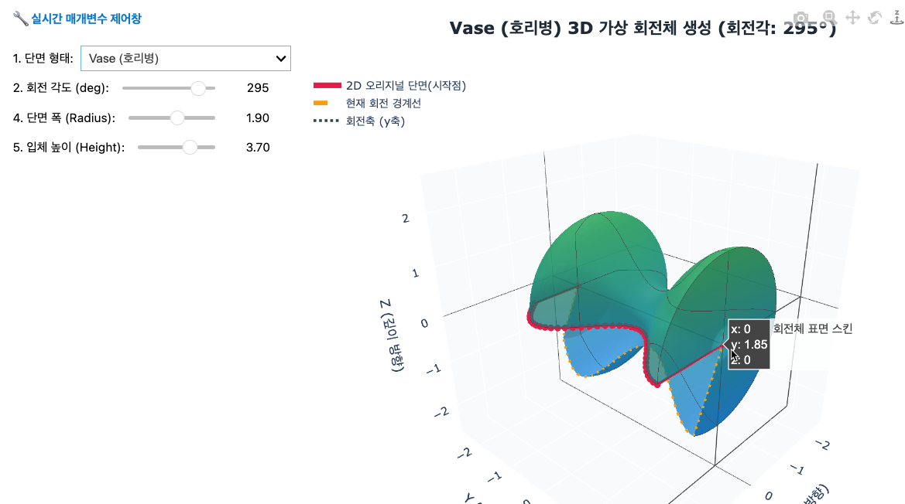

# 06. 입체도형 (Solid Geometry)

> **공간에 부피를 담아 실재(Solid)를 빚다: 완벽한 대칭의 신성과 축(Axis)의 중심력**

---

## 1. 묵상과 사유 (철학적·종교적 관점)

평면에 그려진 선과 도형을 넘어, 우리가 만지고 호흡하는 현실의 3차원 공간으로 들어오는 '입체도형'의 공부는, 마침내 수식과 이성이 만질 수 있는 실체(Solid)로 화하는 존재적 가득 참을 의미합니다.

- **정다면체(Platonic Solids)의 완벽성과 신성 기하학**
  평면 상에서는 정삼각형, 정사각형, 정오각형 등 무한히 많은 정다각형이 존재할 수 있습니다. 그러나 3차원 입체 공간에서 모든 면이 합동이고 꼭짓점에 모이는 면의 개수가 같은 **정다면체는 오직 5가지**(정사면체, 정육면체, 정팔면체, 정십이면체, 정이십면체)뿐입니다.
  고대 철학자 플라톤은 이 5가지 완벽한 입체들이 우주를 구성하는 근원 원소(불, 흙, 공기, 우주/에테르, 물)를 상징한다고 보았습니다. 왜 우주는 단 5개의 다면체에게만 완벽한 공간적 대칭을 허락했을까요? 이는 보이지 않는 창조의 법칙이 지닌 정교한 수학적 임계와 한계, 그리고 우주적 아름다움을 상기시킵니다.

- **차원의 투영과 전개도: 3차원을 펼쳐 2차원을 마주하다**
  입체도형의 전개도(Net)는 3차원의 실체를 2차원의 평면 위에 해체하여 보여주는 도구입니다. 마찬가지로 입체의 그림자나 단면은 늘 입체보다 한 차원 낮은 평면의 형태로 맺힙니다.
  종교적으로 이는 우리 인식의 한계를 돌아보게 합니다. 우리가 경험하는 3차원의 물질 세계와 시공간의 흐름 역시, 고차원적 영적 실재(신)가 3차원의 거울 위에 투영해 둔 그림자나 전개도일 수 있습니다. 입체도형을 만지며 우리는 한 차원 더 높은 절대적 진리의 공간을 겸손하게 갈망하게 됩니다.

- **회전체(Solids of Revolution)의 탄생: 흔들리지 않는 축(Axis)**
  직사각형, 직각삼각형, 반원 같은 2차원의 평면이 굳건한 하나의 직선(회전축)을 중심으로 $360^{\circ}$를 회전하는 순간, 원기둥, 원뿔, 구라는 완전한 균형의 3차원 회전체가 태어납니다.
  이때 중심에 선 '회전축'이 단 1밀리미터라도 흔들리면 회전체는 일그러지거나 무너집니다. 인생과 리더십이라는 궤적 속에서 우리 영혼의 중심축(절대적 가치와 진리)이 흔들림 없이 수직으로 서 있을 때에만, 비로소 왜곡 없는 성숙한 결실(겉넓이와 부피)을 맺을 수 있음을 연상시킵니다.

---

## 2. 왜 사용하는가? 실제 생활에서의 적용점

- **자연이 선택한 최소의 에너지, 최대의 효율: 구(Sphere)**
  수학적으로 '구'는 **동일한 부피를 가질 때 표면적(겉넓이)을 최소화**할 수 있는 유일무이한 기하학적 형태입니다. 하늘에서 떨어지는 물방울이 둥글게 뭉치고, 거대한 우주의 항성과 행성들이 구의 형태를 띠는 것은 자연이 에너지를 최소화하고 물질을 보존하려는 최적화의 원리입니다.
  산업적으로 액체 보관용 탱크나 가스 저장고를 구형으로 만드는 것 역시 용기의 재료비는 줄이면서 가장 많은 양을 안전하게 보관하려는 기하학적 효율성의 실제 응용입니다.

- **안전하게 힘을 흐르게 만드는 분산의 미학: 트러스와 돔**
  정사면체나 정팔면체의 뼈대를 구성하는 삼각형 구조(Truss)는 가해지는 압력을 여러 모서리와 꼭짓점으로 고르게 분산시키는 성질이 있어 다리, 송전탑, 체육관 지붕(지오데식 돔)에 필수적으로 적용됩니다. 입체도형의 뼈대가 문명의 안정성을 물리적으로 수호하는 것입니다.

- **메타버스와 3D 가상 세계를 빚어내는 폴리곤 메시(Polygon Mesh)**
  영화의 3D 그래픽이나 게임 속 가상 공간의 모든 캐릭터와 사물은 컴퓨터가 연산해 낸 수만 개의 미세한 입체도형(폴리곤)의 조합으로 창조됩니다. 컴퓨터 그래픽 카드는 이 수많은 다면체의 모서리와 면의 넓이, 그리고 부피를 실시간으로 연산하여 스크린 너머에 입체적 생명력을 불어넣습니다.

---

## 3. 질문을 통한 한 걸음 더 (Joshua를 위한 열린 질문)

1. **질문 1**: 무한히 뻗어 나갈 수 있는 평면의 세계와 달리, 3차원 입체 공간에서 완벽한 정다면체는 단 5개만 허락된다는 수학적 진리는 Joshua님께 어떤 경외감이나 철학적 생각을 안겨주나요?
2. **질문 2**: 3차원 상의 무거운 입체도 펼쳐서 늘어놓으면(전개도를 그리면) 2차원의 가벼운 평면 위에 투명하게 드러납니다. 내 비즈니스 비전이나 풀리지 않는 복잡한 고민의 3차원적 실체를 '전개도'처럼 투명하고 단순하게 펼쳐본다면, 그것은 어떤 요소들의 결합으로 쪼개어질 수 있을까요?
3. **질문 3**: 평면도형이 회전을 통해 성숙한 부피를 빚어내듯, Joshua님의 인생과 기업 경영을 흔들림 없이 가득 채우고 지탱해 주는 절대적인 '회전축'은 무엇인가요?

---

## 4. 파이썬 시각화 예고

- **`platonic_solids_3d.py`**: 3차원 그래픽 뷰어 속에서 5가지 플라톤 정다면체를 로드하여 회전시키며,
  각 입체의 꼭짓점($V$), 모서리($E$), 면($F$)의 개수를 분석하고 오일러의 다면체 정리($V - E + F = 2$)를 실시간 연산으로 검증하는 3D 시각화 도구.
  
- **`revolution_solid.py`**: 화면 상에 임의의 단면을 그리고 축을 설정하여 마우스로 휠을 돌릴 때,
  2D 도형이 3D 공간 상에서 휩쓸고 지나간 자리에 회전체(원기둥, 원뿔, 구 등)가 실시간으로 부피를 가지며 채워져 렌더링되는 가상 회전체 모델러.
  
