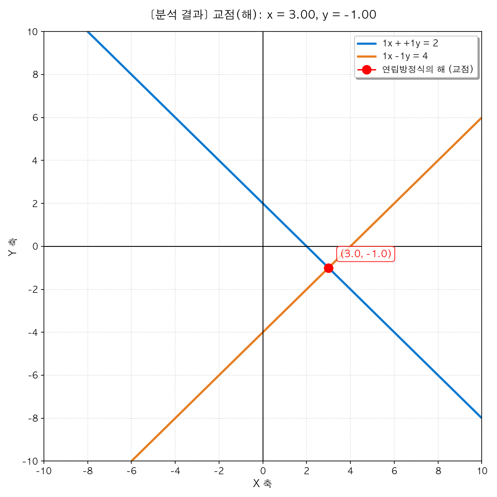
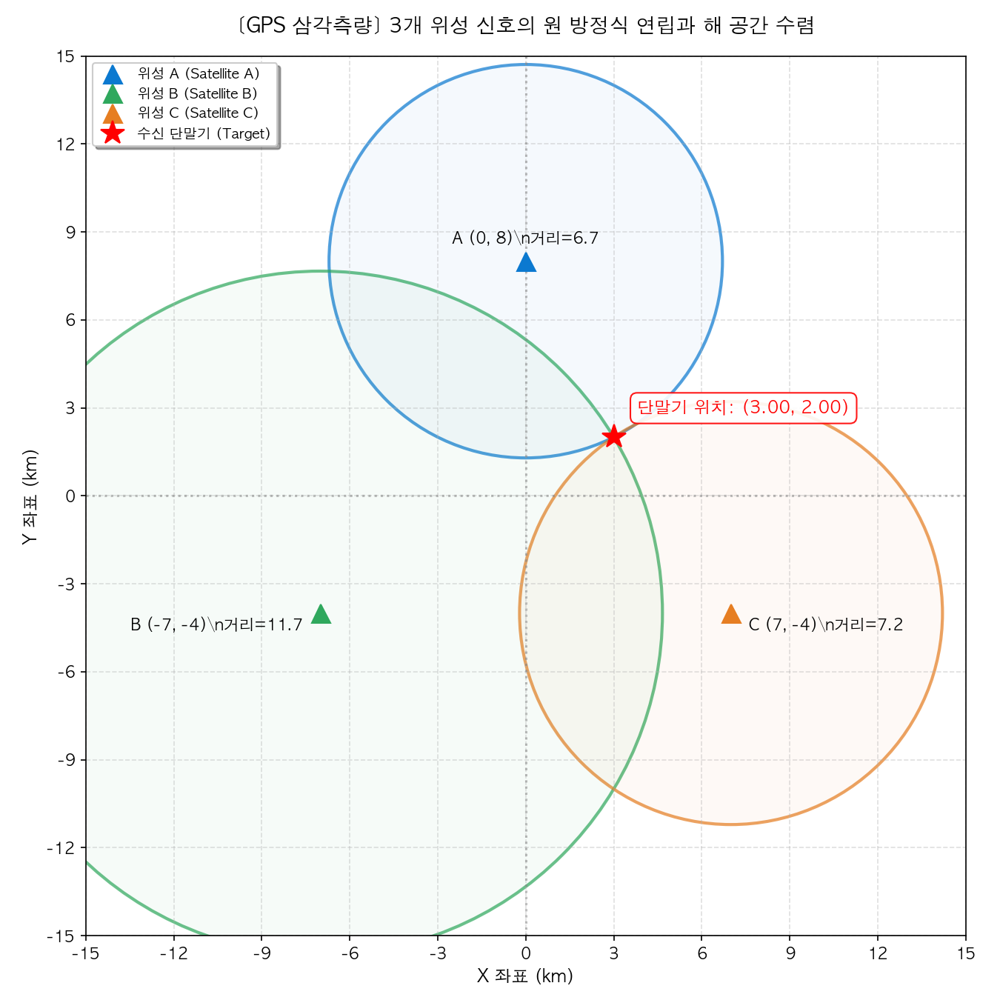

# 03. 연립일차방정식 (System of Linear Equations)

> **서로 다른 조건이 교차하여 빚어내는 유일한 조화, 그리고 소거(Elimination)를 통한 본질의 발견**

---

## 1. 묵상과 사유 (철학적·종교적 관점)
미지수가 2개인 일차방정식 하나는 해가 무수히 많아, 좌표평면 위를 정처 없이 헤매는 무한한 선(Line)을 그립니다. 스스로의 정체성을 한 점으로 규정하지 못하고 방황하던 이 수식은, 또 다른 독립적인 식 하나를 만나 **'연립(System)'**되는 순간, 무한한 가능성의 안개를 걷어내고 단 하나의 고귀하고 유일한 합일점(교점)으로 수렴합니다.

- **독립된 두 존재가 이루는 합일의 미학**
  각각은 무한히 방황할 수 있는 독립된 선(Line)이지만, 두 선이 하나의 약속(System) 아래 묶일 때 비로소 우주에 단 하나뿐인 공통된 진리(해)를 도출해 냅니다.
  철학적·종교적으로 이는 서로 다른 두 인격(부부, 나와 타인, 혹은 나와 신)이 만나 관계를 맺을 때, 각자의 방황을 멈추고 오직 둘 사이에 성립하는 고귀한 균형과 평화의 지점(교점)을 발견하는 신비를 닮아 있습니다. 관계 속에서 존재는 비로소 온전하게 규정됩니다.

- **소거(Elimination)와 대입(Substitution): 비움으로써 얻는 단순함**
  연립방정식을 해결하는 열쇠는 가감법을 통해 미지수 하나를 과감히 '소거(Elimination)'하여 문제를 단순한 일차방정식의 상태로 바꾸는 것입니다.
  우리는 수없이 얽힌 삶의 문제와 복잡한 변수들을 동시에 풀려다 길을 잃곤 합니다. 연립방정식의 풀이는 문제의 실타래를 한 올씩 뽑아내듯, 변수를 하나씩 통제하고 걷어냄(비움)으로써 진정한 해답에 도달하는 생각의 정돈(Retreat) 방식을 보여줍니다.

- **해의 부재와 해의 과잉: 공동체 관계의 묵상**
  두 직선이 어긋나 평행을 달릴 때 연립방정식은 '해가 없습니다'. 반대로 두 직선이 완전히 겹쳐 구분되지 않을 때 '해가 무수히 많습니다'.
  우리의 관계 역시 완벽히 마음을 닫고 평행선만 달리는 평행 상태(해 없음)나, 타자성을 지우고 과도하게 동질화되어 개인의 독립성이 무너진 상태(해의 과잉)는 건강하지 못합니다. 각자의 독립된 궤적을 유지한 채, 정직하게 한 점(교점)에서 만나 소통하는 상태가 연립방정식이 가리키는 유일한 해(조화)의 모습입니다.

---

## 2. 왜 사용하는가? 실제 생활에서의 적용점

- **내 손 안의 우주 내비게이션: GPS 삼각측량 (Trilateration)**
  - 우리가 스마트폰 지도 앱을 켜고 길을 찾을 때, 스마트폰은 우주에 떠 있는 위성 3~4개로부터 신호를 받아 위성과의 거리에 관한 연립방정식을 풉니다. 위성을 중심으로 그려지는 여러 구(Sphere)들의 방정식들이 연립되어 교차하는 단 하나의 위도와 경도 좌표(내 위치)를 나노초 단위로 정확히 계산해 냅니다. 연립방정식이 현대 문명의 공간적 눈이 되어 줍니다.

- **시장의 평화를 결정하는 보이지 않는 손: 수요와 공급의 균형 가격**
  - 경제학에서 시장의 가격과 거래량은 소비자의 구매 욕구를 담은 '수요 곡선식'과 공급자의 생산 의지를 담은 '공급 곡선식'이 만나는 교점에서 최종 결정됩니다. 이 연립방정식의 해가 바로 시장의 혼란을 막고 거래를 안정시키는 '균형 가격(Market Equilibrium)'입니다.

- **가상 세계의 물리적 충돌 감지 (Collision Detection)**
  - 3D 레이싱 게임이나 메타버스 공간에서 자동차가 벽에 부딪히거나 캐릭터가 장애물을 밟는 순간을 실시간 연산하는 것은, 움직이는 물체들의 이동 궤적 방정식을 연립하여 공통의 교점(충돌 좌표)이 발생하는지 실시간으로 감시하고 튕겨 나가게 하는 대수적 제어 장치입니다.

---

## 3. 질문을 통한 한 걸음 더 (Joshua를 위한 열린 질문)

1. **질문 1**: 서로 다른 두 가치(예: 기업과 고객, 비즈니스 성과와 삶의 평화)가 만나 서로의 독립성을 침해하지 않으면서도 완벽한 교점(유일한 해)을 찾아 조화를 이루게 하기 위해, Joshua님이 세워둔 경영의 '연립식'은 무엇인가요?
2. **질문 2**: 복잡하게 꼬인 여러 인생과 사업의 변수들을 직면했을 때, 불필요한 노이즈 변수 하나를 과감하게 소거(가감법)하여 본질에 다가섰던 Joshua님만의 '단순화의 지혜'는 어떻게 작동하나요?
3. **질문 3**: 타인과의 관계에서 완전히 닫힌 평행선(해 없음)이나 지나치게 얽힌 동질화(해의 과잉)를 극복하고, 각자의 궤적을 존중하며 건강하게 한 점(교점)에서 마주하기 위해 삶에서 어떤 훈련이 필요할까요?

---

## 4. 파이썬 시각화 실습

우리는 연립방정식의 기하학적 해의 특징과 실생활의 삼각측량 적용 사례를 직관적으로 체험할 수 있는 인터랙티브 시각화 주피터 노트북을 제공합니다.
노트북 파일: [02_03_system_equation_intersection_gps_trilateration.ipynb](02_03_system_equation_intersection_gps_trilateration.ipynb)

### 1) 일차연립방정식 교점 시각화 (`system_equation_intersection`)
- 두 일차방정식 $ax + by = c$ 와 $dx + ey = f$ 의 계수를 실시간 슬라이더로 조작할 수 있습니다.
- 두 직선이 이루는 교점(해)의 변화를 실시간으로 추적하며, 두 직선이 평행하여 만나지 않는 경우(해 없음)와 일치하는 경우(해 무한)의 기하학적 순간을 자동으로 감정 및 도식화해 줍니다.

### 2) GPS 위성 삼각측량 시뮬레이터 (`gps_trilateration`)
- 2D 평면 위에 배치된 3개의 위성 기지국을 바탕으로 단말기의 실시간 가상 위치 $(x_t, y_t)$를 슬라이더로 조작합니다.
- 단말기 위치에 따라 각 위성까지의 거리를 반지름으로 하는 3개의 원이 수렴하는 수학적 형상과 삼각측량 연립 연산의 핀포인트 결과가 좌표평면 위에 역동적으로 표시됩니다.

