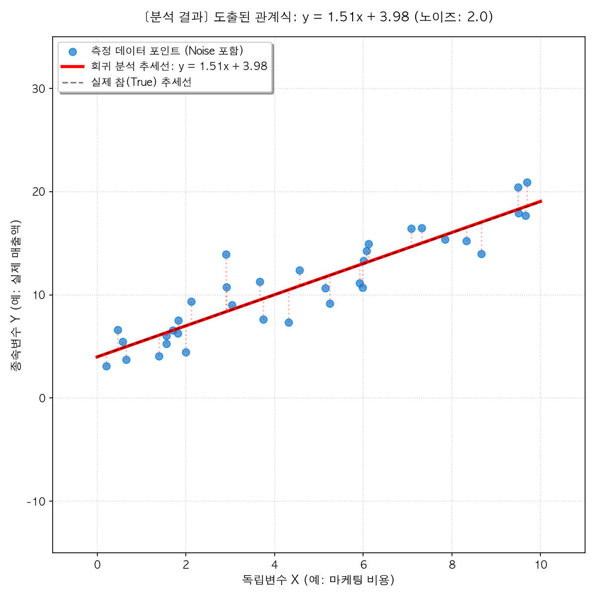
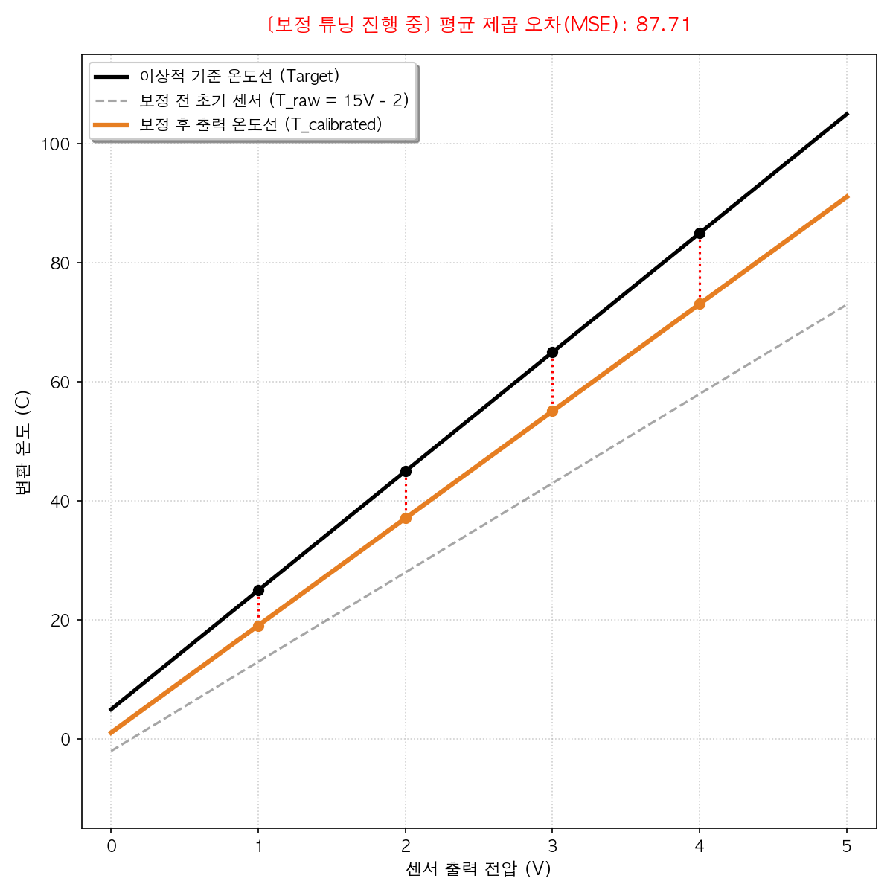

# 04. 일차함수와 그래프 (Linear Functions & Graphs)

> **원인에 상응하는 신실한 결과의 맵핑, 그리고 배경(y절편)을 극복하는 매일의 태도(기울기)**

---

## 1. 묵상과 사유 (철학적·종교적 관점)
이전까지 수식을 조작하고 계산하는 것에 머물렀던 수학은, '함수(Function)'의 도입과 함께 하나의 변수가 움직일 때 다른 변수가 그에 맞물려 연동하는 **'변화와 관계의 법칙'**으로 발돋움합니다.

- **함수(Function): 우주를 작동시키는 인과(Causality)의 신실함**
  입력값 $x$가 들어가면 함수 $f(x)$라는 명확한 규칙을 거쳐 오직 단 하나의 결과값 $y$가 튀어나옵니다. 이는 무질서해 보이는 우주가 실은 심고 거두는 정직한 원인과 결과의 약속 아래 작동하고 있음을 보여줍니다. 
  동일한 원인에 대해 결과가 매번 달라지는 변덕의 세상이 아닌, 심은 대로 거두고(콩 심은 데 콩 나고 팥 심은 데 팥 나는) 행동한 만큼 책임이 따르는 대자연의 도덕적이고 신성한 신실함을 가르쳐 줍니다.

- **배경(y절편)을 압도하는 일상의 지향성(기울기)**
  일차함수 $y = ax + b$에서 **y절편 $b$**는 독립변수 $x$가 0일 때 주어지는 고정된 값으로, 우리가 선택하지 못한 '시작점(배경과 환경)'을 나타냅니다. 반면 **기울기 $a$**는 시간이 흐르고 노력이 누적될 때($x$) 매 순간 나아가는 '변화율이자 지향성'입니다.
  비록 태어난 배경이나 시작점($b$)이 낮고 미약할지라도, 매일을 일구어가는 삶의 방향과 영혼의 태도인 기울기($a$)가 하늘을 향해 단단하게 우상향하고 있다면, 시간($x$)이 흐른 뒤 마주할 삶의 풍성함($y$)은 시작점의 한계를 가볍게 뛰어넘을 것입니다. 중요한 것은 지금 어디에 서 있느냐가 아니라, 나의 기울기가 어느 방향을 조준하고 있는가입니다.

- **평행이동: 삶의 파도 속에서도 변치 않는 신념의 각도**
  일차함수의 그래프를 위아래로 평행이동할 때, 그래프의 위치($y$절편)는 변하지만 직선의 '기울기'는 한 치도 변하지 않습니다.
  이는 우리의 외부 환경이나 지위, 재정 상태(y절편)가 때로는 올라가고 내려가며 요동치더라도, 내면의 중심 가치와 신념의 각도(기울기)만큼은 흔들림 없이 평행하게 품위와 일관성을 고수하는 숭고한 삶의 태도를 묵상하게 합니다.

---

## 2. 왜 사용하는가? 실제 생활에서의 적용점

- **데이터 너머의 성장을 예측하는 나침반: 선형 회귀 (Linear Regression)**
  - 비즈니스에서 마케팅 투자 대비 매출의 증가율, 또는 제품 생산량에 따른 원가 증감 추이를 분석할 때 가장 기초가 되는 머신러닝 기법이 일차함수의 꼴을 찾는 '선형 회귀'입니다. 과거의 데이터 점들 사이로 흐르는 최적의 기울기(효율)와 y절편(고정 비용)을 찾아내어 다음 분기의 경영 성장 지표를 합리적으로 추정해 냅니다.

- **온도에서 센서 보정까지, 물리량의 번역: 캘리브레이션 (Calibration)**
  - 섭씨온도($C$)와 화씨온도($F$)를 환산하는 공식($F = \frac{9}{5}C + 32$)은 정확히 기울기가 $\frac{9}{5}$이고 y절편이 $32$인 일차함수입니다. 정밀 공장이나 사물인터넷(IoT) 센서가 감지한 전기 신호(전압)를 실제 압력, 속도, 온도로 오차 없이 번역해 주는 영점 조절과 눈금 조정(Calibration)의 수학적 기초가 일차함수의 변환식입니다.

- **로봇과 자율주행의 균형을 잡는 경로 보정: 비례 제어 (P-Control)**
  - 드론이 공중에서 수평을 잡거나 자율주행 차량이 차선 한가운데를 유지하기 위해, 중심선에서 벗어난 오차($x$)에 일정한 비율(기울기 $a$)을 곱해 운전대를 조절하는 제어 시스템의 핵심이 바로 비례 제어(Proportional Control)입니다. 오차가 커질수록 교정 복원력도 일차함수적으로 선형적으로 커져 시스템의 균형을 유지합니다.

---

## 3. 질문을 통한 한 걸음 더 (Joshua를 위한 열린 질문)

1. **질문 1**: 미약했던 삶이나 비즈니스의 시작점(y절편 $b$)을 딛고 일어나, 오늘날의 가치 있는 결실을 이루게 한 Joshua님만의 가장 든든하고 강력했던 인생의 '기울기(방향성과 축적의 태도 $a$)'는 무엇이었나요?
2. **질문 2**: 사업의 흥망성쇠나 시대의 변화에 따라 내 환경의 높낮이(y절편)가 끊임없이 요동치더라도, 경영 철학이나 개인 신념 속에서 한 치도 변하지 않고 평행하게 고수해 오신 Joshua님만의 '기울기'는 어떤 모습인가요?
3. **질문 3**: 원인($x$)에 정직하게 조응하여 단 하나의 열매($y$)를 맺게 하는 함수의 정직성을 바라보며, 최근 내 삶과 비즈니스 영역에서 가장 공들여 심어두고 있는 정직한 인과관계의 입력값($x$)은 무엇인가요?

---

## 4. 파이썬 시각화 예고

우리는 중등 2학년의 네 번째 수학 Retreat에서 함수와 그래프의 아름다운 대응을 구현할 것입니다.
- **`linear_regression_helper.py`**: 좌표평면 위에 마우스 클릭으로 가상의 매출이나 고객 행동 데이터 점들을 흩뿌리면, 점들의 트렌드를 가장 완벽하게 관통하는 일차함수 추세선(Linear Regression Line)을 실시간으로 추적하여 그려주고 최적의 기울기와 y절편을 수치로 출력해 주는 선형 회귀 분석기 시각화 툴.

- **`calibration_simulator.py`**: 아날로그 센서 신호(전압)를 감지하여 온도 기기에 맞추어 보정하는 일차함수 $y = ax + b$의 기울기(센서 민감도)와 y절편(영점 조정)을 대화형 슬라이더로 조절하며 계측기가 정밀하게 영점을 맞춰가는 과정을 실시간 눈금 그래프로 보여주는 제어 튜닝 시뮬레이터.
