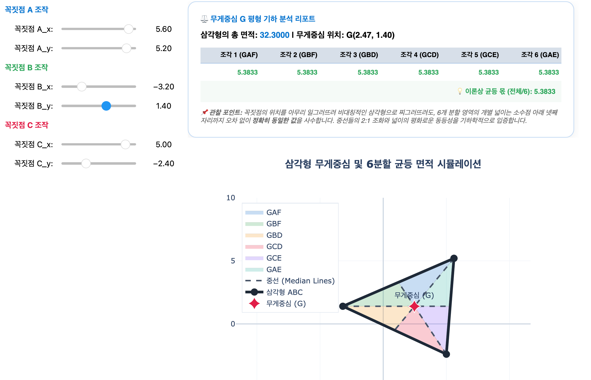
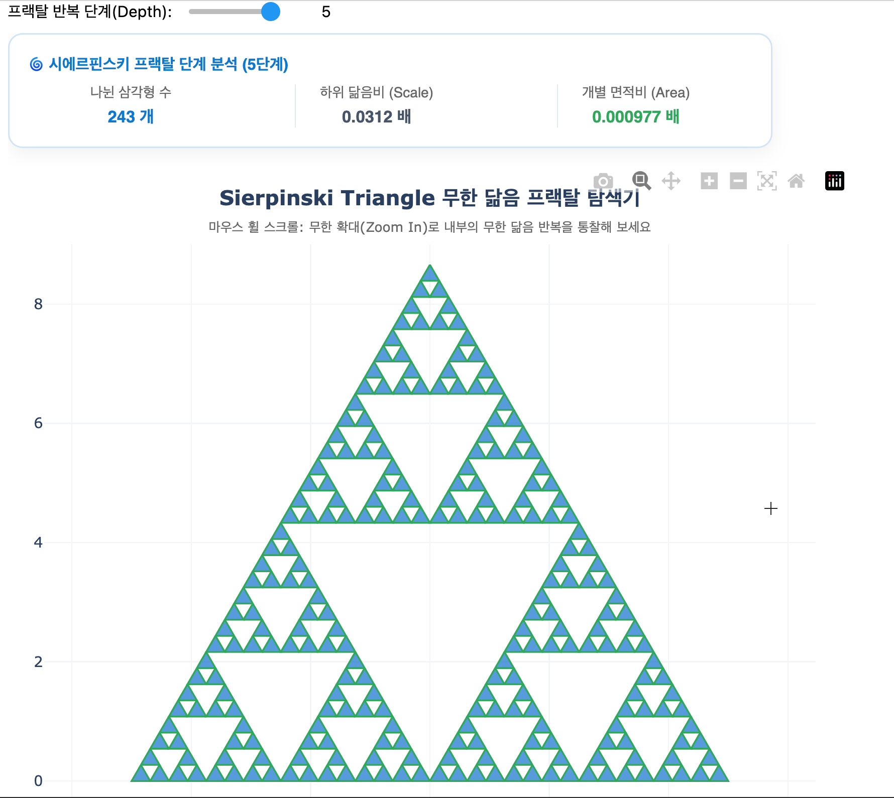

# 06. 도형의 닮음 (Similarity of Geometry)

> **크기는 달라도 본질은 공유하는 조화, 그리고 긴장된 공간의 평화를 수호하는 무게중심**

---

## 1. 묵상과 사유 (철학적·종교적 관점)

합동(Congruence)이 크기와 모양이 한 치의 오차도 없이 일치해야 하는 '쌍둥이의 엄격함'이라면, 닮음(Similarity)은 크기는 다를지라도 형태의 근본적인 비율과 각도를 공유하는 **'본질적 동질성'**의 세계입니다.

- **닮음(Similarity)과 인간론: 지극히 작으나 본질을 품은 존재**
  두 닮은 도형은 비록 외적인 규모(길이)는 다를지라도 내면의 각도와 마주하는 변들의 비율이 완벽하게 일치합니다.
  종교적으로 이는 온 우주를 창조하신 거대한 신의 형상(Imago Dei)을 닮은 유한하고 미소한 인간의 본질을 사유하게 합니다. 비록 우리는 광활한 시공간에 비하면 한 줌의 먼지처럼 작은 물리적 크기를 지녔지만, 영혼의 지향점과 도덕적 각도가 신성한 법을 조준하고 있다면 그 존재의 본질적 가치는 우주의 온전함과 정확히 동치(AA 닮음)가 됨을 가르쳐 줍니다.

- **무게중심(Centroid): 모든 팽팽한 당김의 평화와 2:1의 조화**
  삼각형의 꼭짓점과 대변의 중점을 연결한 세 중선의 교점인 '무게중심($G$)'은 참으로 신비롭습니다. 무게중심은 삼각형의 내부 면적을 정확히 6등분하여 힘의 균형을 완벽히 맞추고, 각 중선을 꼭짓점으로부터 $2:1$이라는 황금 비율로 내분합니다.
  이는 수많은 이해관계와 가치의 팽팽한 당김(세 꼭짓점) 속에서도 어느 한쪽으로 쏠리지 않고 전체 평화를 유지하는 '안정의 앵커'입니다. 관계와 조직의 균형을 잡기 위해 리더가 도달해야 할 최종적인 지혜의 자리를 연상시킵니다.

- **차원의 도약에 따른 부피의 비약: 사소한 스케일의 거대한 임팩트**
  두 도형의 닮음비(길이의 비)가 $m:n$일 때, 면적의 비는 $m^2:n^2$이 되고 부피의 비는 $m^3:n^3$으로 증폭됩니다.
  1차원적인 규모(길이)를 단지 몇 배 늘렸을 뿐인데, 그것이 3차원적 실제 용량과 공간의 실체(부피)에 미치는 영향은 세 제곱으로 비약합니다. 우리의 일상에서 작은 습관과 기초 체력(1차원)을 조금 보강했을 뿐인데, 삶 전체의 용량과 임팩트(3차원)가 어마어마하게 비약하는 존재의 역동적 증폭 법칙을 대변합니다.

---

## 2. 왜 사용하는가? 실제 생활에서의 적용점

- **직접 가볼 수 없는 미지의 세상을 측량하는 비례의 눈: 삼각측량**
  - 고대 이집트의 수학자 탈레스는 피라미드의 높이를 직접 재지 않고, 자신의 지팡이 그림자의 비율과 피라미드 그림자 길이의 닮음비(AA 닮음)를 활용해 피라미드의 높이를 정확히 재어 냈습니다. 오늘날 바다 위 배들의 거리를 측정하거나 우주 별까지의 거리를 계산하는 연주시차 기법 역시 모두 닮음과 비례의 수학적 힘으로 작동합니다. 직접 손댈 수 없는 거대한 대상을 이성으로 통제하는 방법입니다.

- **이미지와 가상 세계의 해상도를 조절하는 디지털 스케일링 (Scaling)**
  - 디지털 지도 앱을 확대(Zoom In)하거나 축소(Zoom Out)할 때, 혹은 3D 캐릭터 모델을 다른 크기로 바꿀 때 화면의 깨짐이나 왜곡 없이 형태를 유지하는 수학적 아핀 변환(Affine Transformation) 알고리즘의 기초가 바로 닮음 변환입니다.

- **비즈니스 스케일업(Scale-up)의 기하학: 갈릴레오의 제곱-세제곱 법칙**
  - 생물의 길이(크기)가 2배가 되면, 근육의 단면적(넓이)은 4배가 되지만 체중(부피)은 8배가 됩니다. 갈릴레오는 이 때문에 벼룩이 사람 크기로 닮음 확대되면 자신의 체중을 견디지 못하고 다리가 부러진다는 사실을 밝혔습니다.
  - 비즈니스 역시 조직 규모(길이)가 커질 때 단순히 복제 확대하면 시스템(부피)의 하중을 견디지 못합니다. 닮음비를 고려하여 조직 뼈대와 지원 시스템의 면적(단면적)을 기하급수적으로 보강해야 하는 구조적 스케일업 전략의 기초 논리입니다.

---

## 3. 질문을 통한 한 걸음 더 (Joshua를 위한 열린 질문)

1. **질문 1**: 크기는 지극히 작지만 내면의 기하학적 각도와 구조(AA 닮음)가 온전하여 거대한 본질을 완벽하게 재현해 내는 소수 정예 비즈니스나 개인의 역량이 대기업의 규모(합동)를 극복했던 Joshua님만의 경험이 있으신가요?
2. **질문 2**: 삼각형의 세 중선이 만나 언제나 안정된 균형을 이루며 중선을 2:1로 분할하는 '무게중심'처럼, 복잡한 비즈니스 파트너십이나 조직 이해관계의 긴장 속에서 Joshua님이 딛고 서시는 흔들림 없는 '의사결정의 무게중심'은 무엇인가요?
3. **질문 3**: 닮음비($L$)의 미세한 확장이 부피($L^3$)의 지수적 비약을 낳는 것처럼, 비즈니스의 사소한 변수(예: 전환율, 재구매율)를 아주 조금 조정했을 뿐인데 사업 전체의 수익성과 임팩트가 폭발적으로 비약했던 순간은 언제였나요?

---

## 4. 파이썬 시각화 예고

우리는 중등 2학년의 여섯 번째 수학 Retreat에서 아름다운 기하학적 스케일을 코드로 다룰 것입니다.

- **`centroid_balancer.py`**: 사용자가 마우스로 삼각형의 세 꼭짓점을 동적으로 드래그하여 형태를 바꿀 때, 세 중선의 교점인 무게중심($G$)의 좌표를 실시간 추적하고, 분할된 6개의 삼각형 영역의 넓이가 언제나 완벽하게 동일함을 보여주며, 중선의 2:1 내분을 시각화하는 동적 역학 시뮬레이터.
  
- **`fractal_generator.py`**: 아주 작은 부분의 모양이 전체 도형의 모양과 끊임없이 닮아 있는 프랙탈(시에르핀스키 삼각형 또는 코흐 눈송이) 구조를 생성하고, 마우스 휠 줌(Zoom)을 통해 무한한 축소 시점 속에서도 완벽히 동일한 닮음의 본질이 무한 루프로 반복되는 구조를 탐색하는 그래픽 렌더러.
  
