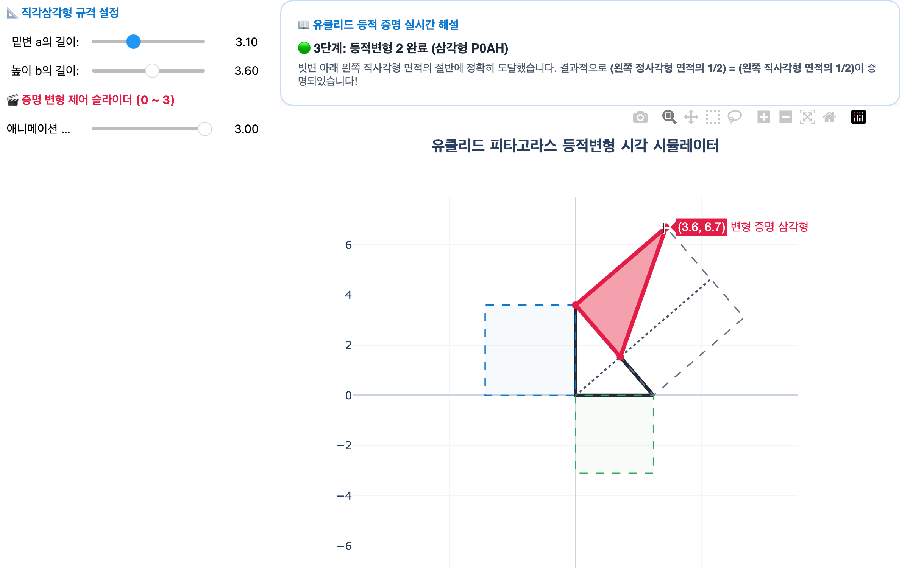
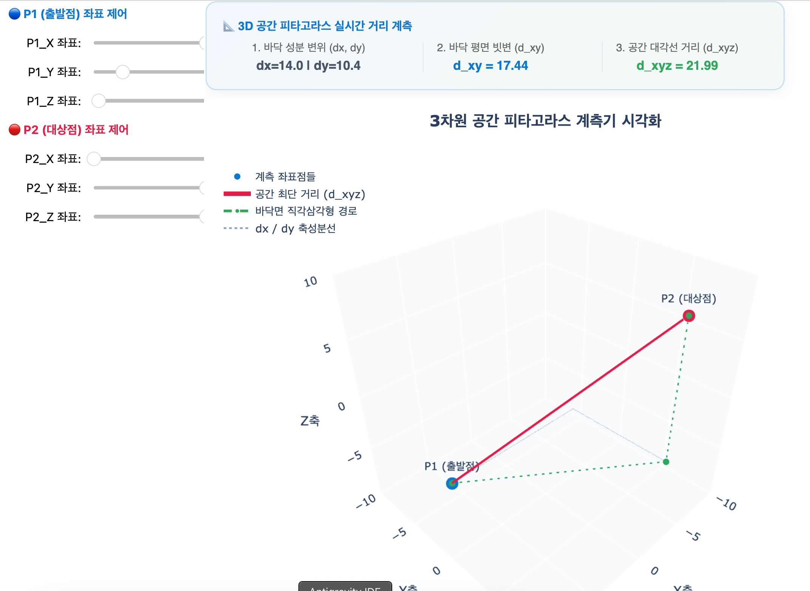

# 07. 피타고라스 정리 (Pythagorean Theorem)

> **정직한 직각(90°)이 빚어내는 조화의 수식, 그리고 이성(Rationality)의 한계 너머 열리는 초월의 신비**

---

## 1. 묵상과 사유 (철학적·종교적 관점)

피타고라스 정리는 인류 수학 역사상 가장 널리 알려진 동시에 가장 심오한 우주의 질서를 드러내는 수식입니다. 직각삼각형이라는 지극히 단순한 형태 속에 숨겨진 제곱의 합의 일치와 이로 인해 촉발된 역사적 사건은 철학적으로 매우 깊은 묵상을 건넵니다.

- **직각(Right Angle)의 올곧음이 주는 조화: 공의의 수식**
  세상의 수많은 어긋나고 찌그러진 삼각형들 중에서, 오직 하나의 내각이 정직한 수직과 수평의 교차($90^{\circ}$)를 이루는 직각삼각형에만 우주의 가장 완전한 조화의 수식인 $a^2 + b^2 = c^2$이 작동합니다.
  수학에서 직각은 영어로 'Right Angle'이며, 이는 철학적·종교적으로 타협하지 않는 정직함과 올곧음, 즉 '공의(Righteousness)'를 대변합니다. 우리의 영적 지표와 가치가 타협 없이 정직하게 서 있을 때 비로소, 우리 삶의 대각선(빗변 $c$)은 밑변($a$)과 높이($b$)의 제곱의 합이라는 놀라운 균형을 형성하며 인생의 양 기둥을 안전하게 엮어낼 수 있습니다.

- **선에서 면적으로의 도약: 보이지 않던 면적의 일치**
  피타고라스 정리의 참된 기하학적 실체는 세 변의 '길이' 자체의 관계가 아닙니다. 밑변을 한 변으로 하는 정사각형의 '넓이($a^2$)'와 높이를 한 변으로 하는 정사각형의 '넓이($b^2$)'를 더하면, 빗변을 한 변으로 하는 정사각형의 '넓이($c^2$)'와 정확히 일치한다는 **면적의 보존 법칙**입니다.
  단순한 1차원의 눈(선)으로는 절대 포착할 수 없던 진리가, 2차원의 눈(면적)으로 사고의 차원을 넓히는 순간 선명한 일치와 평화로 눈앞에 펼쳐집니다. 삶의 문제를 납작한 단면으로만 보고 고민할 때는 보이지 않던 출구가, 영적인 지평을 넓혀 입체적인 넓이로 상황을 조망할 때 비로소 온전한 질서로 통합됨을 가르쳐 줍니다.

- **이성의 한계선에서 만난 무리수의 신성한 충격**
  피타고라스 학파는 "만물은 정수의 비율(유리수)로 아름답고 정교하게 짜여 있다"는 강력한 수학적 종교 신념을 가졌습니다. 그러나 한 변의 길이가 1인 직각삼각형의 빗변 길이($x^2 = 1^2 + 1^2 = 2$)를 피타고라스 정리로 구하려 할 때, 그 어떤 정수의 비로도 가둘 수 없는 초월의 수 $\sqrt{2}$를 목격하고 깊은 종교적 충격을 받았습니다.
  이는 인간 이성의 완벽주의를 부수고, 이성의 감옥 너머에 엄연히 존재하는 신비로운 초월의 세계(무리수)를 정직하게 인정하게 만드는 겸손의 계기였습니다. 인간의 규칙이 무너지는 임계에서 참다운 경외심의 문이 열립니다.

---

## 2. 왜 사용하는가? 실제 생활에서의 적용점

- **모든 3D 가상 공간과 위치 계측의 기본 척도: 유클리드 거리 (Euclidean Distance)**
  - 스마트폰 화면의 위치 감지, 로봇 청소기의 2D 맵핑, 그리고 화려한 3D 메타버스 게임 속에서 두 노드(Node) 사이의 거리를 계산하는 공식은 $d = \sqrt{(x_2-x_1)^2 + (y_2-y_1)^2}$ 입니다. 이것은 피타고라스 정리의 대수적 확장입니다. 게임 속 캐릭터의 타격 판정과 미사일의 궤적 충돌 감지 연산에 피타고라스 정리가 매 초당 수억 번 실행되며 가상 우주의 거리를 규정합니다.

- **레이저 레벨기 없이 완벽한 직각을 잡는 건설의 지혜: 3-4-5 법칙**
  - 고대 이집트의 나일강 범람 후 토지 구획부터 오늘날 건축 현장의 베테랑 목수들에 이르기까지, 완벽한 수직과 수평의 기틀을 잡기 위해 3m, 4m, 5m 길이의 밧줄과 줄자를 엮어 직각삼각형을 만듭니다. 피타고라스 정리가 보장하는 `3:4:5` 비율은 기계식 측정기 없이도 대지 위에 완전한 직각의 뼈대를 안전하게 구축해 줍니다.

- **디스플레이 사양의 기준: 대각선 인치와 종횡비**
  - 스마트폰, 모니터, TV 크기를 말하는 27인치, 65인치 등의 기준은 화면의 대각선(빗변) 길이입니다. 디스플레이 엔지니어들은 화면의 화면비(예: 16:9)와 피타고라스 정리를 활용하여 가로, 세로의 실제 치수와 해상도 픽셀 밀도를 계산하고 설계합니다.

---

## 3. 질문을 통한 한 걸음 더 (Joshua를 위한 열린 질문)

1. **질문 1**: 세상을 정교한 인과와 계산(유리수)으로 다 설명하려 하던 피타고라스 학파가 직각삼각형 빗변에서 설명할 수 없는 수($\sqrt{2}$)를 만나 이성의 한계를 마주했듯, Joshua님의 인생이나 비즈니스 속에서 논리적 계산을 넘어선 초월적 영역과 신비(무리수)를 경외하며 겸손하게 받아들였던 경험은 무엇인가요?
2. **질문 2**: 단순히 1차원의 선(길이)으로만 볼 때는 꼬여서 풀리지 않던 상황이, 2차원의 면적(넓이와 지평)으로 사유의 차원을 넓혔을 때 유레카처럼 완벽한 조화로 통합되고 해소되었던 순간이 있으신가요?
3. **질문 3**: 고대 건축 목수들이 3-4-5 비율의 줄로 기둥의 수직을 정렬하듯, 요동치고 찌그러지기 쉬운 일상 속에서 Joshua님의 영혼과 의사결정을 온전하게 정렬시켜 주는 나만의 '수직수평 기준자(3-4-5 밧줄)'는 무엇인가요?

---

## 4. 파이썬 시각화 예고

우리는 중등 2학년의 일곱 번째 수학 Retreat에서 기하학의 가장 위대한 보석을 구현할 것입니다.

- **`euclidean_proof_animator.py`**: 역사상 가장 엄밀하고 아름다운 증명으로 평가받는 유클리드(Euclid)의 피타고라스 정리 증명(직각삼각형의 세 변을 정사각형으로 확장하여 평행이동과 등적변형을 통해 면적이 같음을 입증하는 과정)을 실시간 도형 분할 및 슬라이더 조작 애니메이션으로 감상하는 시각화 도구.
  
- **`distance_detector_3d.py`**: 3차원 가상 좌표 공간 위에 두 개의 임의의 점을 띄우고 사용자가 마우스로 드래그하여 움직일 때, 두 점 사이의 3차원 유클리드 거리($d = \sqrt{dx^2 + dy^2 + dz^2}$)를 피타고라스 정리의 입체 확장식으로 실시간 연산하여 계측 선과 함께 화면에 3D 그래픽으로 실시간 렌더링해 주는 공간 계측 시뮬레이터.
  
