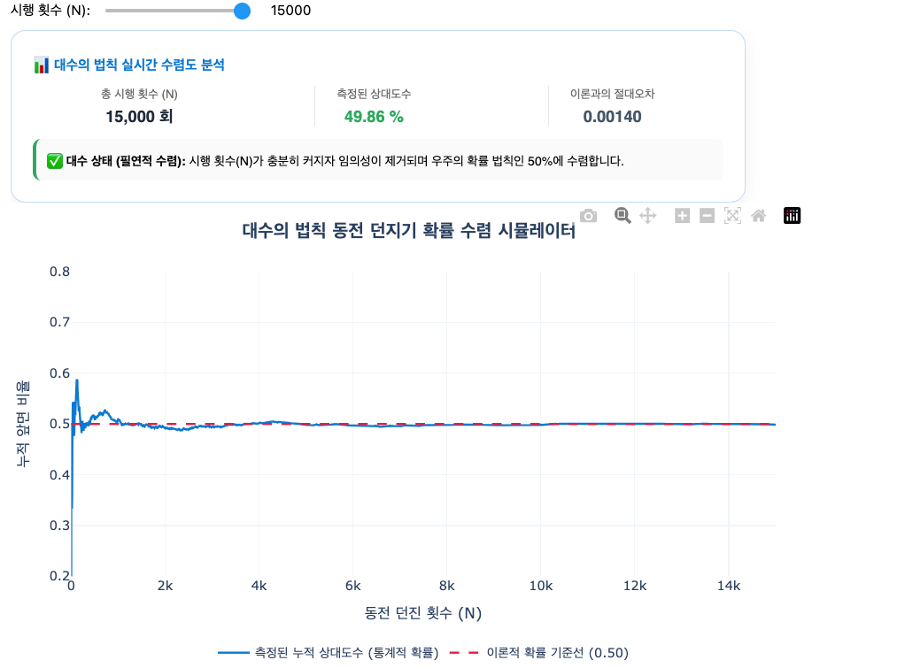
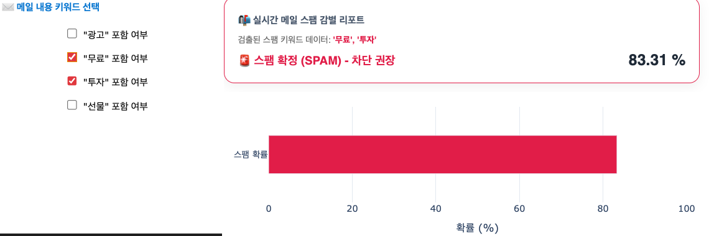

# 08. 확률 (Probability)

> **불확실성의 안개를 걷어내는 지혜의 척도, 그리고 여사건(Complementary Event)이 일러주는 비움의 미학**

---

## 1. 묵상과 사유 (철학적·종교적 관점)

중학교 2학년 수학 과정의 최종 장인 '확률' 단원은, 한 치 앞도 보장할 수 없는 인간 삶의 근원적 불확실성(Uncertainty)을 정교한 이성의 비율로 측정하고 대처하려는 믿음의 수학입니다.

- **0(불가능)과 1(확정) 사이의 거대한 영적 스펙트럼**
  확률 $P$는 언제나 $0 \le P \le 1$이라는 엄밀한 경계 안에 존재합니다.
  - **확률 0**은 결코 일어나지 않는 완강한 거절이자 '절대적 불가능'을 대변합니다.
  - **확률 1**은 반드시 일어나고야 마는 신성한 약속이자 '완벽한 확정성'을 상징합니다.
    인간의 삶은 절대적 절벽(0)과 완전한 확정(1) 사이의 무수한 '가능성의 회색 지대'를 걸어가는 여정입니다. 확률은 우리로 하여금 불완전함(모름)을 겸손하게 시인하게 만드는 동시에, 불확실함 속에서도 가장 가치 있는 일(높은 확률의 지향점)을 향해 용기 있게 한 걸음 내딛는 신뢰와 신앙의 본질을 반추하게 합니다.

- **여사건(Complementary Event)의 지혜: 반대를 통한 본질의 이해**
  수학에서 복잡하고 난해한 어떤 사건이 일어날 확률을 구할 때, 직접 그 확률을 구하는 것보다 그것이 **"일어나지 않을 확률(여사건)"을 구하여 전체(1)에서 빼내는 방식($1 - P(A^c)$)**이 훨씬 명쾌하고 선명한 답을 줄 때가 많습니다.
  철학적으로 이는 우리가 추구하는 긍정의 가치(평화, 성공, 행복)를 온전히 획정하기 위해, 그것을 방해하는 부정한 노이즈와 집착(여사건)을 응시하고 덜어내는 비움의 미학을 일러줍니다. 부정(Negative)을 명확하게 정의하여 걷어낼 때, 긍정(Positive)의 실체는 절로 선명하게 빛을 발합니다.

- **우연 속의 준엄한 수렴: 대수의 법칙(Law of Large Numbers)**
  한두 번의 주사위 던지기는 완전한 무작위(우연)처럼 보이지만, 이를 수만 번 무한히 반복하면 신비롭게도 확률은 약속된 하나의 지표($\frac{1}{6}$)로 자석처럼 부드럽게 수렴합니다.
  단기적으로는 불공평해 보이고 종잡을 수 없는 매일의 삶도, 일관성 있는 사소한 선행과 훈련을 무한히 반복해 쌓아갈 때 마침내 인생 전체의 궤적은 약속된 진리와 성숙의 자리로 한 치의 오차 없이 귀환함을 상기시킵니다.

---

## 2. 왜 사용하는가? 실제 생활에서의 적용점

- **불확실성을 비즈니스로 변환하는 뼈대: 보험과 리스크 계리 학문**
  - 개개인의 사고와 사망은 예측 불가능한 불행이지만, 수백만 명의 데이터를 확률적으로 모형화하는 대수의 법칙을 통과하면 전체 시스템은 매우 예측 가능하고 안정적인 금융 우주(보험 산업)로 재탄생합니다. 불확실성이라는 공포의 대상을 통제가 가능한 비즈니스로 치환하는 도구가 확률 이론입니다.

- **인공지능(AI)과 자율주행의 판단 두뇌: 베이즈 정리 (Bayes' Theorem)**
  - 스팸 메일 필터링, 의료 진단 AI의 질병 판단, 챗GPT의 문장 생성, 자율주행 센서의 장애물 인지 기술의 본질은 '조건부 확률'의 동적 보정입니다. 불완전한 단서(데이터)를 마주할 때마다 기존의 가능성을 지혜롭게 업데이트하며 최적의 판단을 내리는 뇌의 원리를 확률로 구현합니다.

- **디지털 시스템의 무중단 신뢰성 설계: 서버 이중화**
  - 클라우드 서버 인프라 설계자들은 시스템 다운 확률을 획기적으로 낮추기 위해 서버를 병렬로 이중화합니다. 단일 서버의 장애 확률이 $1\%$($0.01$)일 때, 두 서버가 동시에 붕괴할 확률은 곱의 법칙에 의해 $0.01 \times 0.01 = 0.0001$($0.01\%$)로 수직 하강합니다. 확률의 통제를 통해 문명 인프라의 지속성(99.999% 가용성)을 수호합니다.

---

## 3. 질문을 통한 한 걸음 더 (Joshua를 위한 열린 질문)

1. **질문 1**: 절대적인 거절(0)과 완벽한 확정(1) 사이의 무수한 가능성의 스펙트럼 속에서, Joshua님은 비즈니스 투자나 의사결정을 내릴 때 리스크의 안개를 걷어내고 주체적인 '확률적 믿음'을 실현하셨던 가장 찬란한 순간은 언제였나요?
2. **질문 2**: 풀기 힘든 비즈니스의 복잡한 난제를 만났을 때, 그것이 해결될 조건들을 나열하기보다 '실패를 유발하는 핵심 노이즈(여사건)'를 찾아 정의하고 하나씩 제거($1 - P(A^c)$)함으로써 명쾌한 돌파구를 얻었던 경험이 있으신가요?
3. **질문 3**: 대수의 법칙처럼, 개별적인 우연의 날씨 속에서도 Joshua님이 매일 반복하여 축적하고 있는 핵심 습관들이 장기적으로 향해 가고 있는 궁극의 수렴점(인생 확률 1)은 어떤 모습인가요?

---

## 4. 파이썬 시각화 예고

우리는 중등 2학년 수학 Retreat의 최종 마침표를 찍으며 확률의 역동성을 코딩할 것입니다.

- **`law_of_large_numbers.py`**: 동전 던지기나 주사위 굴리기 시뮬레이션을 실행하여, 초기 10~50회 시행 시에는 확률 그래프가 0.2에서 0.9까지 거칠게 요동치다가, 누적 10,000회 이상으로 시행 횟수(N)를 늘려감에 따라 그래프가 극적인 안정세를 취하며 정확한 이론적 수학 확률($0.5$ 또는 $\frac{1}{6}$)로 자석처럼 부드럽게 수렴해 가는 대수의 법칙 애니메이션 시각화 스크립트.
  
- **`bayes_spam_filter.py`**: 메일 속의 특정 키워드의 존재 여부에 따라 가상의 메일이 스팸(Spam)일 확률을 베이지안 확률 공식으로 실시간 계산하여, 추가 단어(데이터)가 유입될 때마다 스팸 판정 확률의 수치가 실시간으로 갱신(Update)되는 대화형 조건부 확률 예측 대시보드.
  
